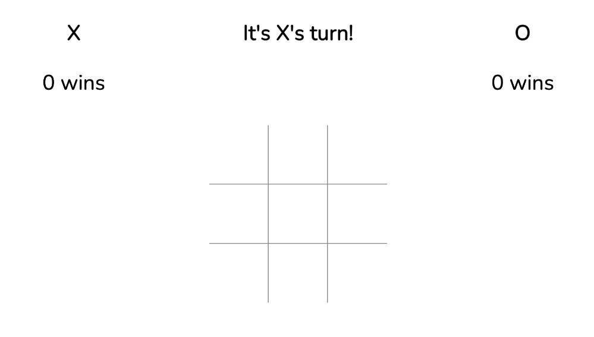
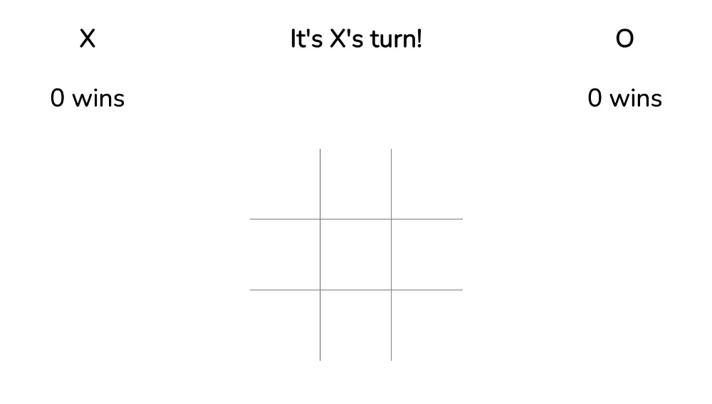

# Tic-Tac-Toe
**Created by [Josh Bennett](https://www.linkedin.com/in/joshua-bennett793)**
  

## 📝 Description

This Tic-Tac-Toe application is a recreation of the classic Tic-Tac-Toe game we all know and love. Players take turns placing their token on the gameboard in an attempt to place their token in 3 grid squares in a row. First to place 3 tokens in a row wins!

## 🧑‍💻 Set Up

1. Clone this repo to your local machine by running the command
`git clone git@github.com:JoshBennett793/turing-tic-tac-toe.git`
2. Type  `cd turing-tic-tac-toe` to move into the root directory
3. Open the application in your browser by running the command `open index.html`
4. Have fun playing Tic-Tac-Toe!

## 📚 Learning Goals
- Solidify and demonstrate my understanding of:
    - DRY JavaScript
    - event delegation to handle similar event listeners
- Understand the difference between the data model and how the data is displayed on the DOM
- Iterate through/filter DOM elements using only for loops
- Use a problem solving process to break down large problems, solve things step by step, and not rely on an outside “answer” to a logical challenge

## 🎥 Videos

  
 ⚙️ Functionality 

  
  | Description | Screenshot |
  |------------ | -----------|
  | <h3 align="center">X wins! | 
  | <h3 align="center">Tie Game! | 

## 💻 Technologies Used
  
 

